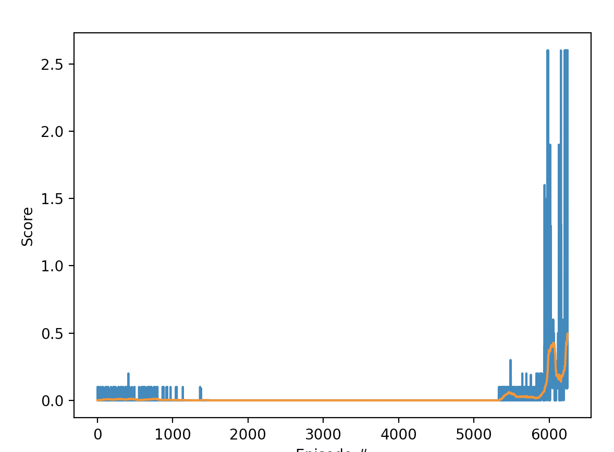

### Algorithm
We use MADDPG to solve this environment with heavy help from the starter code in Udacity, https://github.com/SENC/AiTennis and https://github.com/shartjen/Tennis-MADDPG.  Specifically, we have two agents, each with their own Actor and Critic nets pulling from the same Replay Buffer. Both have the following specs:

Actor:
* Hidden layer of 128
* BatchNorm1d layer to stablize the model
* Hidden layer of 256
* Relu non-linear layers
* tanh output layer to constrain the output between -1 and 1

Critic:
* Hidden layer of 128
* BatchNorm1d layer to stablize the model
* Hidden layer of 256
* Relu non-linear layers
* No non-linearity on the output of the last layer
 
Hyperparameters:
* gamma=0.99,
* tau=1e-3,
* number_of_episodes=10000 (never reached)
* batchsize=256,
* noise_scale=1, (amplitude of OU noise)
* noise_reduction=0.999 (reduce noise by this factor every episode)
* episode_per_update=1 (do this many episodes and then do updates)
* updates_per_round=2 (number of times to soft_update per each update cycle)
* lr_actor=1.0e-4,
* lr_critic=1.0e-3,
* weight_decay=0,
* mu=0, (for noise)
* theta=0.15, (for noise)
* sigma=1.0, (for noise)
* buffer_size=int(5e5),
* seed=2,

### Plot of Rewards
We can see the agent getting better over time with the following plot:

We can see that our agent surpasses the threshold of 0.5 and terminates after ???? episodes with an average score of ???? over the proceeding 100 episodes.

### Ideas for Future Work

One option woould be to do the next level multi-agent lab, which would be [Soccer](https://github.com/Unity-Technologies/ml-agents/blob/master/docs/Learning-Environment-Examples.md).

Frankly, I'm way more curious about why the hyperparameters here worked.  I found myself resource constrained and couldn't do hyperparameter sweep to justify some of these options besides "I found it on the Udacity forums".  In some cases, the lab trained up to 0.1, crashed, crashed again, and only after accidentally running the code for too long did it succeed.  I'd like to understand why the heck that worked.
